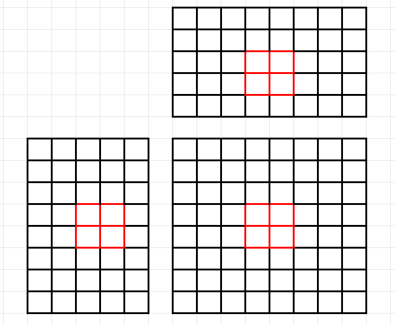

# cuda_learning

## gemm
- 定义GEMM为： C = alpha * A * B + beta * C
- 计算复杂度： 矩阵乘部分：A*B得到的矩阵，每个元素需要K次乘法，K-1次加法，一共（2K-1）次浮点运算，总共（2K-1）*（MN）次
              然后放缩需要执行MN次浮点运算，一共约2KMN次浮点运算 即 2KMN FLOPs
- 为了方便计算，下面的程序 alpha=1, beta=0 
### 03_gemm/sgemm_naive.cu
- 不加任何优化版本，和cpu有对比，并计算了多个MNK组合下的性能，在A100上运行结果，best为272.0232 GFLOPS， A100峰值性能fp32 156 TF，连1%都没有发挥
- 以 M=512, N=512, K=512 为例，分析计算过程workflow
    1. 在global memory中为矩阵A,B,C 分配device memory
    2. 由于矩阵C的每个元素的计算相互独立，因此在并行度映射中让每个thread对应矩阵C中的一个元素的计算
    3. 执行配置 gridDim, blockDim均为2维
``` bash
gridSize.x * blockSize.x = M
gridSize.y * blockSize.y = N
```
- 每个thread的workflow为：从矩阵A中读取一行，从矩阵B中读取一列，对两个向量做点积运算，结果写回矩阵 C
### 03_gemm/sgemm_v1.cu
- 通过矩阵分块优化计算访存比，利用share memory减少重复的内存读取
回顾一下前面的过程，分析下该kernel函数中A,B,C三个矩阵对global memory的读写情况
读取：
- 对于C中的每一个元素计算，需要读取A中的一行元素(k个)
- 对于C中同一行的n个元素，需要重复读取A n次
- 对于C中的每一个元素计算，需要读取B中的一列元素(k个)
- 对于C中同一列的n个元素，需要重复读取B m次
写入：
- 对于C中的每一个元素只需要写入一次

综上：
- 对A n*m*k次load
- 对B n*m*k次load
- 对C n*m*k次write

但是实际上用NVVP 中 Memory Bandwidth Analysis看的load和store的次数却对不上，原因如下：

GPU指令执行的最小单元是warp（32个thread）, 同一个warp内thread读写操作可以部分合并，具体来说，对于一个warp中的32个thread（按上面的naive版本的矩阵乘，是一个thread计算C中的一个结果，每次循环读取A中的一行中的一个元素，读取B中的一列中的一个元素），会计算C中连续的32个元素（假设是这样）
c[x][y] = a[...][y] * b[x][...]
c[x+1][y] = a[...][y] * b[x+1][...]
c[x+2][y] = a[...][y] * b[x+2][...]
在每一次循环中，需要读取矩阵A中的同1个元素（一次transaction），读取矩阵B中连续的32个元素
1 transaction 可以访问32Byte的数据，也就是8个 float， 一次要访问B矩阵中的32个float，也就是需要4次transaction
总结一下，对A矩阵需要1次transaction，对B矩阵需要4次transaction，总共5次transaction

warp对global memory的访问均已最大实现了合并访问，但仍有很多重复访问，例如，对A矩阵的读取，通过合并访问，原本需要总共读取 mxnxk次(理论)，但是实际上计算C的某一行的时候，是在重复读取A的对应一行，重复读取了k次，总共有m行，重复了m*k，次，其中，warp的优化，使得重复读取降低到m*k/32次，对于B矩阵，则32个线程可以用4次transaction，8个thread的读取可以合并为一次，实际重复读取次数为n*k/8。
在不改变这种数据读取方式的前提下，可以用演示更小，带宽更高的share memory代替global memory来实现数据的重复访问，基本思想是充分利用数据的局部性，让一个block内的thread先从global memory读取子矩阵块数据（大小为block_size X block_size），然后把分块数据写入share memory，让每个thread从share memory读取数据，从而避免了global memory的访问。

注意 shTileA[threadIdx.y][threadIdx.x] 这里block*block的小矩阵的索引关系，思考一下是threadIdx.y是0维度，因为先横着移动，threadIdx.y不变
这里可以通过调整block_size的大小来控制共享存储的使用，从而影响性能，实测64*64比32*32 FLOPS多出50%左右,但是会带来准确性下降，未知原因